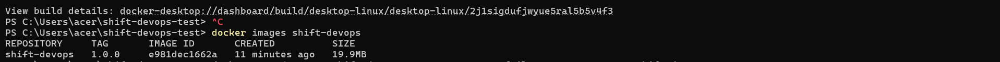
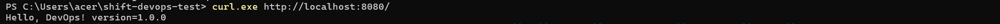
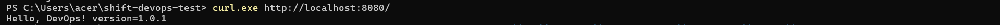
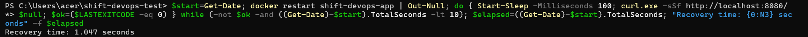
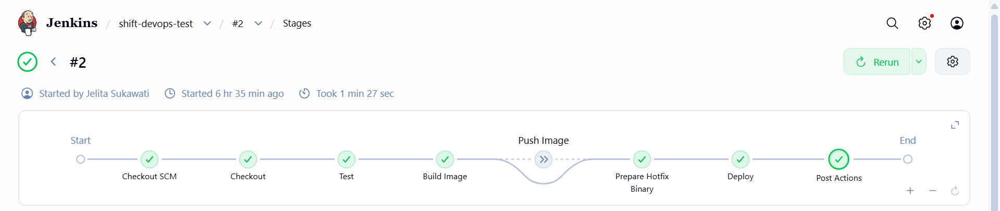
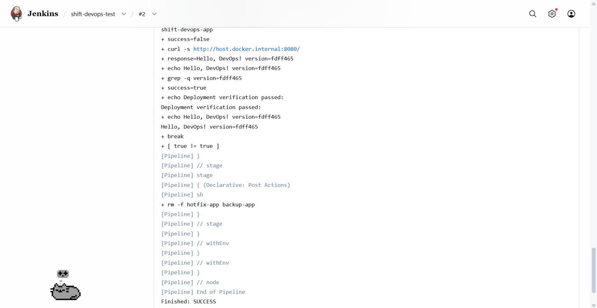

# Shift Engineer - DevOps Technical Test

## Environment

- **Go:** 1.27.1
- **Docker:** 28.0.4
- **Jenkins:** Local Jenkins running in Docker
- **OS:** Windows 10 + WSL 2

---

## I. Build

### Multi-stage Dockerfile

The application uses a multi-stage Docker build:

- **Builder:** `golang:1.27.1-alpine`
- **Runtime:** `alpine:3.22`
- Built with `CGO_ENABLED=0 GOOS=linux GOARCH=amd64` to produce a statically linked binary.
- Only the compiled binary is copied to the final image, so the Go toolchain is not required at runtime.

Alpine was chosen as a lightweight runtime base while providing the minimal Linux userspace required by the application.

### Build & Version Injection

Version is injected at build time using Go linker flags:

```powershell
docker build --build-arg VERSION=1.0.0 -t shift-devops:1.0.0 .
```

`GET /` returns:

```text
Hello, DevOps! version=1.0.0
```

### Final Image Size

```text
REPOSITORY     TAG       IMAGE ID       CREATED       SIZE
shift-devops   1.0.0     e981dec1662a   5 hours ago   19.9MB
```

**Final image size: 19.9 MB**

The builder stage is excluded from the final image, leaving only the compiled binary and the lightweight Alpine runtime.



---

## II. Deploy

### Container Deployment

```powershell
docker run -d `
  --name shift-devops-app `
  --restart on-failure:5 `
  -p 8080:8080 `
  shift-devops:1.0.0
```

Verify:

```powershell
curl.exe http://localhost:8080/
```

```text
Hello, DevOps! version=1.0.0
```

### Binary Hotfix Without Image Rebuild

The hotfix uses `docker cp` to replace the binary inside the existing container.

Build the hotfix binary:

```powershell
$env:CGO_ENABLED="0"
$env:GOOS="linux"
$env:GOARCH="amd64"

go build `
  -trimpath `
  -ldflags="-s -w -X main.version=1.0.1" `
  -o app-hotfix .
```

Back up the current binary:

```powershell
docker cp shift-devops-app:/app .\app-old
```

Copy and replace the binary:

```powershell
docker cp .\app-hotfix shift-devops-app:/app.new
docker exec shift-devops-app sh -c "chmod +x /app.new && mv /app.new /app"
```

Restart the existing container:

```powershell
docker restart shift-devops-app
```

This approach avoids rebuilding the Docker image and recreating the target container. The existing binary is backed up before replacement to support rollback if verification fails. After the swap, the same container is restarted and the endpoint is checked for the new version. This provides a simple binary-level hotfix mechanism that can also be automated through Jenkins.

### Verification

**Before swap**

```text
Hello, DevOps! version=1.0.0
```



**After swap + restart**

```text
Hello, DevOps! version=1.0.1
```



The **same container and image** remained in use during the hotfix.

**Measured recovery time: 1.047 seconds**



---

## III. CI/CD with Jenkins

### Pipeline

```text
Checkout → Test → Build Image → Push (Optional) → Prepare Hotfix Binary → Deploy → Verification
```

- **Checkout:** pulls source code from GitHub.
- **Test:** runs `go test ./...`; a failed test stops the pipeline before build/deploy.
- **Build Image:** uses the short Git commit hash as the version and image tag.
- **Push:** optional; configured for `ghcr.io/hrthvln/shift-devops-test`.
- **Deploy:** automatically applies the binary replacement mechanism from Part II.
- **Credentials:** registry credentials use Jenkins Credentials Binding (`registry-credentials`); no secrets are hardcoded.

### Rollback

The current `/app` binary is backed up before deployment. If restart or version verification fails, Jenkins restores the backup binary, restarts the container, and marks the pipeline as failed.

### Successful Pipeline Run

Jenkins build #2 completed successfully.

```text
Checkout               SUCCESS
Test                   SUCCESS
Build Image            SUCCESS
Push                   SKIPPED (PUSH_IMAGE=false)
Prepare Hotfix Binary  SUCCESS
Deploy                 SUCCESS
Verification           SUCCESS
```

Verification:

```text
Hello, DevOps! version=fdff465
Deployment verification passed
Finished: SUCCESS
```




---

## Quick Start

### Test

```powershell
go test ./...
```

### Build

```powershell
docker build --build-arg VERSION=1.0.0 -t shift-devops:1.0.0 .
```

### Run

```powershell
docker run -d `
  --name shift-devops-app `
  --restart on-failure:5 `
  -p 8080:8080 `
  shift-devops:1.0.0
```

### Verify

```powershell
curl.exe http://localhost:8080/
```
